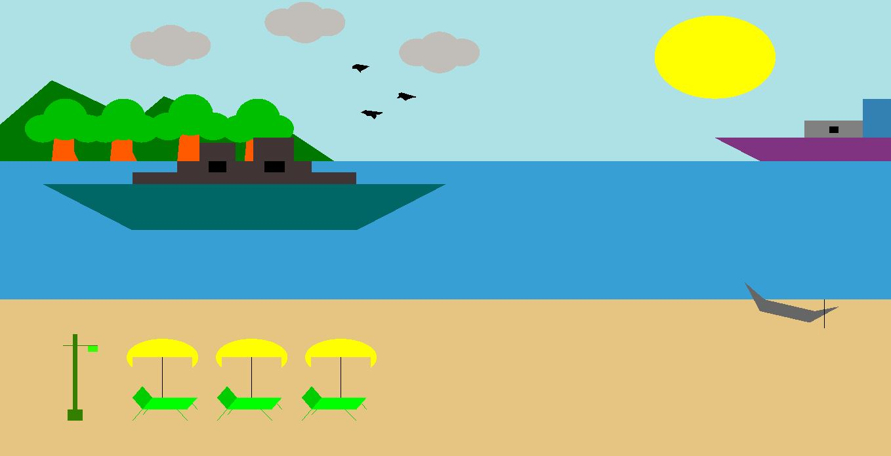

# Sea-Beach
Computer Graphics Project ,OpenGL Project 

Sea BeachFeatures & Description:The project is about a sea beach  withcomponents including sea , ship, wind mill, sun, moon , birds ,hills , trees , people ,umbrella, chair etcusing OpenGL. 
There will have night mode and day mode also and some events will be moving such as ship, birds, wind mill ,sea etc.Features:
1.Sea with ship
2.Night and day mode
3.people will visit sea beach
4.clouds
5.wind mills
6.moving birds,clouds

Tools and Software:OpenGL library, C++ and Code Blocks

                                                    Output

                                                  Day mode

                                                  Night mode

